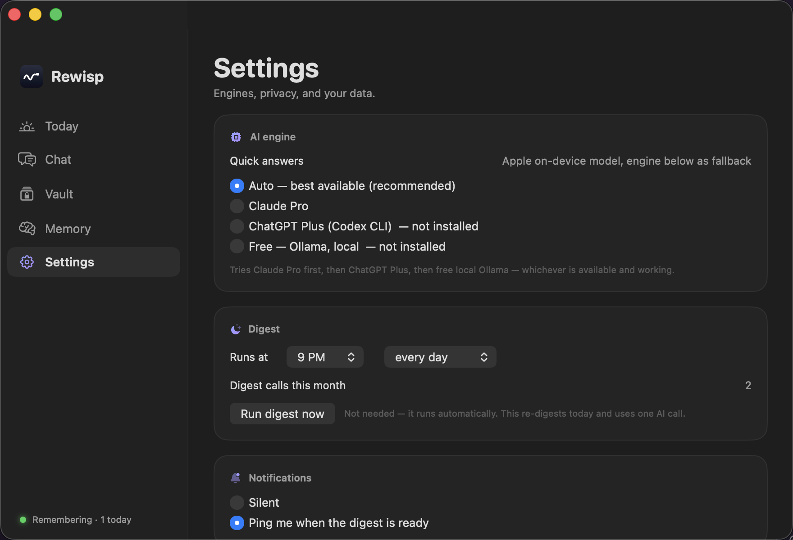

<div align="center">


# Rewisp

**An ambient memory for your Mac.**
Every glimpse of your screen becomes a **wisp** — its text remembered, never the pixels.
Ask anything later and Rewisp *revisits* those wisps to answer.

[](https://github.com/yashmitb/Rewisp/releases/latest/download/Rewisp.dmg)
[](https://www.producthunt.com/products/rewisp-an-ambient-memory-for-your-mac)

[](LICENSE)
[](https://github.com/yashmitb/Rewisp/releases)
[](https://github.com/yashmitb/Rewisp/releases/latest)
[](https://github.com/yashmitb/Rewisp/stargazers)

macOS 15+ · Apple Silicon · free and open source · no account, no API key

[Website](https://yashmitb.github.io/Rewisp/) · [Install guide](https://yashmitb.github.io/Rewisp/install.html) · [Manual](docs/MANUAL.md) · [Security](docs/SECURITY.md)

</div>

---

> *"What was due on July 12th?"* · *"What was that video I watched last night?"* · *"What's my advisor's email?"*

Answers come from Apple's on-device model in a few seconds, and a badge shows which engine replied. When the on-device model isn't confident, Rewisp escalates to whatever you already pay for — **Claude Pro → ChatGPT Plus → free Gemini → local Ollama** — and never to a billed API key. Personal facts come straight out of your Vault, deterministically, with a Copy button.

## Why it exists

I kept forgetting what I'd done. Not big things, just *what did I actually do this morning*, or the name of a page I'd read two days ago and now needed. The information had all been on my screen. It was just gone.

So Rewisp remembers it for me, and I ask instead of digging.

## It thinks, not just stores

- **Promises** — it catches commitments as they scroll past (*"I'll send it Friday"*) and brings them back the morning they're due. You never typed a reminder.
- **What changed on this page?** — every version of a page is kept as text, so Rewisp can diff them and tell you what was added, changed, or removed.
- **Meaning-based search** — ask for *"that article about burnout"* and find the page that said *"exhaustion"*. Local embeddings fused with keyword search.
- **Numbers over time** — a label and number you see repeatedly (weight, grade, price) becomes a tracked sparkline.
- **Precognition** — the suggested questions are guessed from what's on screen right now plus what you usually ask.
- **The forgetting model** — Rewisp learns *how you forget*, strengthens what you look up, and lets the rest fade.
- **Connect your agents** — expose your memory to Claude Desktop, Cursor, or any MCP client as read-only tools. Local stdio, no network listener, Vault excluded.

<div align="center">

</div>

## Install

**[Download Rewisp.dmg](https://github.com/yashmitb/Rewisp/releases/latest/download/Rewisp.dmg)**, then:

1. **Drag Rewisp into Applications** — do this before opening it. Rewisp's background helper is launched from wherever the app lives, so a copy running off the disk image stops working the moment you eject it.
2. **Double-click it. Expect to be blocked.** Rewisp isn't notarized (that needs a paid Apple account), so macOS refuses the first time.
3. **System Settings → Privacy & Security → Open Anyway.** On macOS 15+ right-click → Open no longer works; Apple removed that shortcut.
4. **Allow Screen Recording for "Rewisp Backend"** when asked. That's the background helper, and it's the whole thing working.

Nothing to run in Terminal and no Python to install — the app ships its own runtime and sets up its own background helper on first launch. [Illustrated walkthrough →](https://yashmitb.github.io/Rewisp/install.html)

**Updating** is one click from inside the app: Rewisp downloads, replaces itself, and reopens. Your memories are untouched.

macOS *will* ask you to re-enable screen access afterwards. That is not a bug and nothing is lost — macOS identifies apps by an exact code signature, and since Rewisp isn't signed with a paid Apple certificate yet, an updated build looks like a different app and the old permission is dropped. Rewisp opens a page after updating that clears the stale entry and walks you through it in one click. A Developer ID certificate would remove the whole situation.

**Uninstalling** is in Settings → Your data → Uninstall. It stops the helper, releases permissions, and moves everything to the Trash, keeping your memories unless you tick the box. For older versions, `scripts/uninstall.sh` does the same.

## How it works

```
┌─ triggers ─────────────┐   ┌────────────┐   ┌─────────────┐
│ app switch · new URL   │ → │ screenshot │ → │  Vision OCR │ → SQLite FTS5
│ scroll settle · 60s HB │   │ (in-memory │   │  (on-device)│    (text only)
└────────────────────────┘   │  only)     │   └─────────────┘
                             └────────────┘
Ask (⌘⇧Space) → hybrid retrieval → Apple on-device model (free, private)
                                   └→ Claude / ChatGPT / Gemini / Ollama when it's hard
Nightly digest (9 PM) → one call → recap · loose threads · things worth remembering
```

- **Screenshots are never written to disk.** Each frame is OCR'd in memory and released; only the recognized text is stored.
- **Everything stays local** — one SQLite database in `~/Rewisp`, on-device OCR, on-device answering. The only things that ever leave are the prompt for a question you asked, and the once-daily digest.
- **The kill list is absolute.** Messages, WhatsApp, password managers, banking sites, and private windows pause capture entirely. Not filtered afterwards — paused, so there is no row.
- **The Vault** holds your resume, addresses, and standard answers as trusted truth. Files that look like credentials are refused at the door.

### Honest about the boundaries

- Rewisp only reads **text rendered on screen**. A promise made out loud on a call is invisible to it unless it appears as a caption, a transcript, or something you type.
- The database is **encrypted at rest** (SQLCipher, AES-256). The key lives in your login Keychain and unlocks automatically, because the capture daemon has to run before you've touched the machine. That protects the file itself: a stolen disk, a backup, a copied folder, another account. It does **not** protect against a process already running as you — that process can read the same Keychain item. Touch ID gating wouldn't change that, since the daemon must hold the key to keep capturing.
- Answers are only as good as what was on screen. "Not found in your memory" means it genuinely wasn't there.

## Contributing

Contributions are welcome, and the first outside PR ([#1](https://github.com/yashmitb/Rewisp/pull/1)) fixed two real bugs I'd shipped.

**Getting set up:**

```sh
git clone https://github.com/yashmitb/Rewisp.git
cd Rewisp
pip3 install pyobjc model2vec pytest    # model2vec powers semantic search; optional
python3 -m pytest tests/ -q             # 214 tests, should be green
python3 -m rewisp daemon                # grant Screen Recording when prompted
cd ui && ./build.sh --install           # builds + installs /Applications/Rewisp.app
```

**Before you open a PR:**

```sh
./scripts/check.sh   # tests, imports, Swift build, live API smoke — the same gate CI runs
```

**What helps a PR land quickly:**

- **Say what breaks and how you know.** A reproduction beats a description.
- **Add a regression test** for the failure mode, if it's testable. `tests/` is plain pytest.
- **Explain the why in the code**, not just the what — this codebase leans on comments that say why a thing is the way it is, especially around macOS behaviour that isn't obvious.
- **Keep it focused.** One problem per PR is far easier to review than five.

**Good places to start:** anything in [issues](https://github.com/yashmitb/Rewisp/issues), or the open items in [`docs/todo.md`](docs/todo.md). Larger things currently unowned: app-level encryption at rest, the capture-loop memory leak, and auth on the MCP server.

**Things that will get pushed back on**, because they're project constraints rather than preferences:

- Anything that writes a screenshot to disk.
- Anything that bills a paid API key. Rewisp uses subscriptions you already have, free tiers, or on-device.
- Anything that weakens the kill list, or stores credentials in the Vault.
- Anything that adds a cloud dependency to the capture path.

## Repository

| Path | What it is |
|---|---|
| `rewisp/` | Python daemon — capture, OCR, storage, retrieval, token-gated localhost API |
| `ui/Sources/` | SwiftUI menu bar app, ⌘⇧Space panel, main window |
| `scripts/` | Runtime bundling, DMG packaging, install/uninstall, stats |
| `docs/` | [Manual](docs/MANUAL.md), [brief](docs/BRIEF.md), [progress log](docs/PROGRESS.md), [security](docs/SECURITY.md), [research](docs/research.md) |
| `site/` | Landing page (GitHub Pages) |
| `tests/` | pytest suite |

Useful scripts: `scripts/stats.sh` (download and traffic numbers), `scripts/fresh-test.sh` (rehearse a real install without losing data), `scripts/make_dmg.sh` (build the distributable).

## Privacy principles

1. The image lives in memory only. OCR, then gone.
2. Text only, local only, `~/Rewisp`.
3. The kill list is absolute.
4. Credentials are never stored — refused at ingest.
5. At most one automated AI call per day. Everything else is user-triggered or on-device.
6. Forget the last 10 minutes, any time, one click.

## Launch

Rewisp launched on [Product Hunt](https://www.producthunt.com/products/rewisp-an-ambient-memory-for-your-mac) on 20 July 2026 and finished **#5 product of the day with 187 upvotes**.

The most useful thing to come out of it wasn't the ranking — it was people poking at the parts I'd been vague about. Where exactly the boundary of "reads your screen" sits, whether the database is encrypted at rest, how six months of full-screen text stays searchable in one SQLite file. Several answers in this README are sharper because of those questions, and the "honest about the boundaries" section exists because of them.

## License

[MIT](LICENSE) © Yashmit Bhaverisetti
